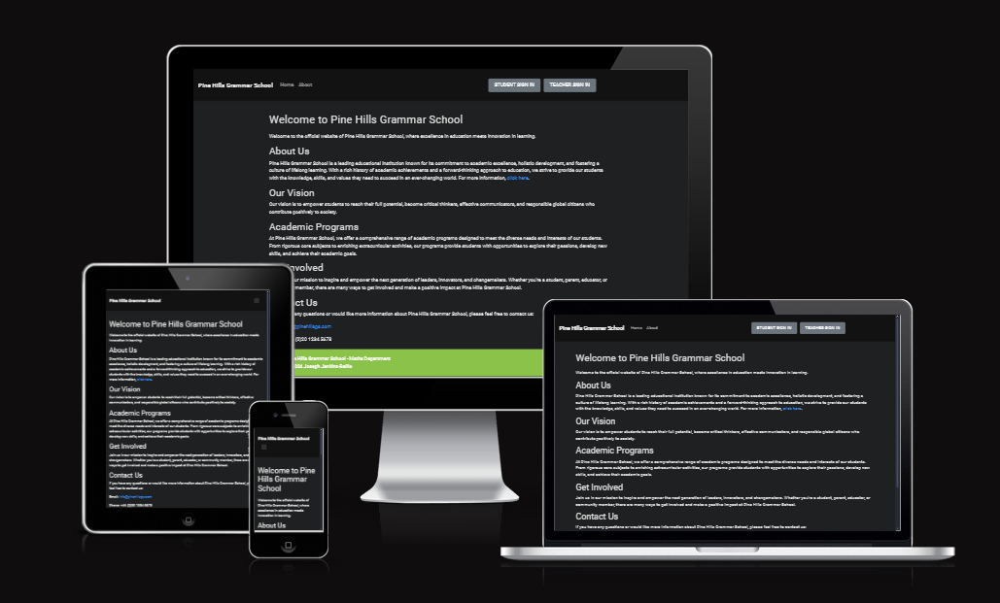
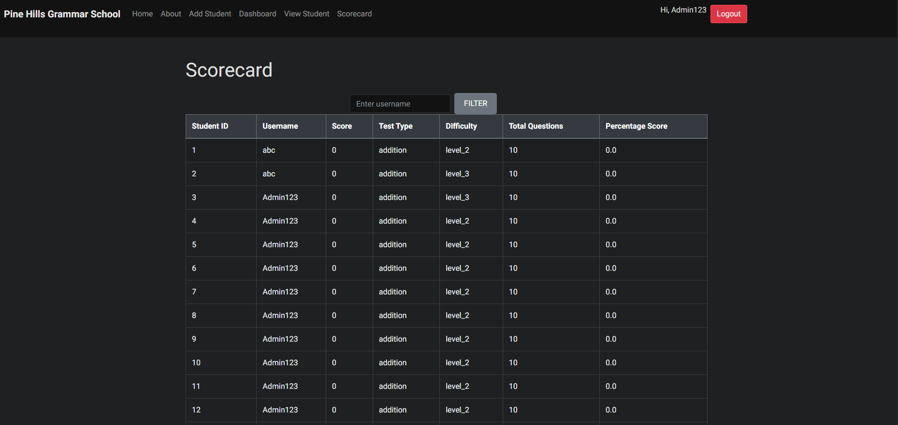

# Pine Hills Grammar School - Maths Department

This project is a full-stack web application developed for the fictional Pine Hills Grammar School's Maths Department. The application provides students and staff with functionalities like lesson access, score tracking, and user management. It is built using Django, HTML, CSS, and JavaScript, and is designed to enhance the learning experience through a user-friendly interface.



A live link to the application can be found [here](https://p4-pine-hill-1bd3ad95c68b.herokuapp.com).

## Table of Contents

- [Overview](#overview)
- [Agile Methodology](#agile-methodology)
- [User Experience (UX)](#user-experience-ux)
  - [Strategy / Site Goals](#strategy--site-goals)
  - [Scope / User Stories](#scope--user-stories)
    - [As a Teacher](#as-a-teacher)
    - [As a Student](#as-a-student)
  - [Structure and Design Choices](#structure-and-design-choices)
    - [Structure](#structure)
    - [Design Choices](#design-choices)
- [Features](#features)
  - [Existing Features](#existing-features)
  - [Detailed Features](#detailed-features)
  - [Future Features](#future-features)
- [Technologies Used](#technologies-used)
  - [Languages](#languages)
  - [Libraries and Frameworks](#libraries-and-frameworks)
  - [Tools](#tools)
- [Deployment](#deployment)
- [Testing](#testing)
- [Bugs](#bugs)
  - [Solved Bugs](#solved-bugs)
  - [Remaining Bugs](#remaining-bugs)
- [Credits](#credits)
  - [Code](#code)
  - [Media](#media)
- [Acknowledgements](#acknowledgements)

[Back to Top](#pine-hills-grammar-school---maths-department)

## Overview

Pine Hills Grammar School - Maths Department is a web application aimed at providing students and staff with a comprehensive platform to manage and access educational resources. It includes functionalities like user authentication, lesson management, score tracking, and user administration.

[Back to Top](#pine-hills-grammar-school---maths-department)

## Agile Methodology

The development of this project followed Agile Methodology to ensure an iterative and flexible approach. The project was divided into multiple sprints, and progress was tracked using GitHub Projects, which can be viewed [here](https://github.com/users/jftjenkins/projects/5).

### Planning

- **User Stories:** Created detailed user stories to capture the requirements and expectations from different users, including students and teachers.
- **Acceptance Criteria:** Each User Story contains Acceptance Criteria and an overview, some of which I had to add after I had already implemented them into my code as I was not sure what Acceptance Criteria would be required.
- **Labels:** Used labels such as "Future Features", "May Have", and "Must Have" to prioritize tasks and features.

Using Agile Methodology ensured that the project stayed on track, met user requirements, and adapted to changes efficiently.

[Back to Top](#pine-hills-grammar-school---maths-department)

## User Experience (UX)

### Strategy / Site Goals

Pine Hills Grammar School's Maths Department aims to enhance the learning experience of students and streamline administrative tasks for teachers. The application provides functionalities such as lesson access, score tracking, and user management, making it easier for students to learn and for teachers to manage their classes effectively.

The target audience includes:
- **Students:** Who need to access lessons, take quizzes, and track their progress.
- **Teachers:** Who need to manage courses, monitor student performance, and handle administrative tasks.

### Scope / User Stories

This section outlines the expectations from different users interacting with the platform. Each User Story was recorded in GitHub Issues and categorized to facilitate the development process.

#### As a Teacher:

- [I can manage course content and user accounts](https://github.com/users/jftjenkins/projects/5/views/1?pane=issue&itemId=56695625) so that I can ensure the platform operates smoothly.
- [I can authenticate myself](https://github.com/users/jftjenkins/projects/5/views/1?pane=issue&itemId=65632017) so that I can access the appropriate functionalities based on my role.
- [I can log out of my account](https://github.com/users/jftjenkins/projects/5/views/1?pane=issue&itemId=65632256) so that I can securely end my session.
- [I can create, edit, and delete student accounts](https://github.com/users/jftjenkins/projects/5/views/1?pane=issue&itemId=65632146) so that I can maintain an updated list of student users.
- [I can reset a student's password](https://github.com/users/jftjenkins/projects/5/views/1?pane=issue&itemId=65632167) so that I can assist students who have forgotten their passwords.
- [I can access the admin dashboard](https://github.com/users/jftjenkins/projects/5/views/1?pane=issue&itemId=65632079) so that I can manage student accounts and view their progress.

#### As a Student:

- [I can access different lessons by category and see my progress on a leaderboard](https://github.com/users/jftjenkins/projects/5/views/1?pane=issue&itemId=56695554) so that I can monitor my learning journey.
- [I can take quizzes and assessments within courses](https://github.com/users/jftjenkins/projects/5/views/1?pane=issue&itemId=56695602) so that I can evaluate my understanding of the material.
- [I can view the home page when I access the website](https://github.com/users/jftjenkins/projects/5/views/1?pane=issue&itemId=57706511) so that I can quickly understand the purpose of the website and navigate to different sections easily.
- [I can view my scorecard](https://github.com/users/jftjenkins/projects/5/views/1?pane=issue&itemId=65632215) so that I can track my progress and performance in the lessons.
- [I can access different levels of maths lessons](https://github.com/users/jftjenkins/projects/5/views/1?pane=issue&itemId=65632187) so that I can practice and improve my skills.

### Structure and Design Choices

#### Structure

The structure of the Pine Hills Grammar School - Maths Department application is designed to be intuitive and user-friendly. The main components include:

- **Home Page:** Provides an overview of the website's purpose and features, with clear navigation to different sections.
- **Authentication:** Separate login pages for students and teachers, with appropriate access controls based on user roles.
- **Dashboard:** Different dashboards for students and teachers, displaying relevant information and functionalities.
- **Lesson Pages:** Categorized lessons with randomly generated questions to practice different maths skills.
- **Scorecard:** A dedicated page for students to view their progress and for teachers to monitor student performance.
- **Admin Panel:** For teachers to manage student accounts, reset passwords, and view analytics.

#### Design Choices

The design choices for the application were made to ensure clarity, accessibility, and a modern look and feel. The following tools and resources were used:

- **Fonts:**
  - Fonts were chosen using [Typ.io](https://typ.io) to ensure readability and consistency across the application.

- **Color Palettes:**
  - Colors were selected using [Adobe Color](https://color.adobe.com/create/color-wheel) and [Colormind](http://colormind.io) to create a visually appealing and cohesive color scheme.

- **Icons:**
  - Icons were sourced from [Font Awesome](https://fontawesome.com) to enhance the visual appeal and usability of the application.

These choices ensure that the application is not only functional but also visually engaging, making the learning experience more enjoyable for students and the management process more efficient for teachers.

[Back to Top](#pine-hills-grammar-school---maths-department)

## Features

### Existing Features

- **User Authentication:**
  - Students and teachers can log in to access their respective dashboards.
  - Authentication forms for both students and teachers with password visibility toggling.

    <details>

    <summary>Click here to view screenshots of Login Pages</summary>

        Student Signin Page
    

        Teacher Signin Page
    

        Password Box with Password Hidden
    

        Password Box with Password Shown
    

    </details>

- **Home Page:**
  - Provides an overview of the website's purpose and features.
  - Offers clear navigation to different sections of the site.
  - Includes a visually appealing and user-friendly layout.

    <details>

    <summary>Click here to view screenshots of the Home Page</summary>

        Home Page
    .png)

    </details>

- **About Page:**
  - Gives detailed information about the Maths Department and its mission.
  - Provides contact information and links to other resources.

    <details>

    <summary>Click here to view screenshots of the About Page</summary>

        About Page
    .png)

    </details>

- **Lesson Access:**
  - Students can view all available lessons.
  - Lessons are categorized by topics such as Addition, Subtraction, Multiplication, and Division.
  - The page can only be accessed after logging in.

    <details>

    <summary>Click here to view screenshots of student lesson page</summary>

        Student Lesson Page
    

    </details>

- **Score Tracking:**
  - Students can take quizzes, and their scores are recorded.
  - Scorecards are available for students and teachers to track performance.
  - The scorecard can only be accessed after a user logs in

    <details>

    <summary>Click here to view screenshots of Scorecard</summary>

        Scorecard Page
    

    </details>

- **User Management:**
  - This page can only be accessed by teachers after they have logged in with their details.
  - This page cannot be accessed by students with their login details.
  - Teachers can add, edit, and view student information.
  - Teachers can manage student login credentials and profiles.
  - Teachers can delete student accounts to maintain an updated list of users.

    <details>

    <summary>Click here to view screenshots of User Management</summary>

        Teachers Create Student Page
    

        Teachers View Student Page
    

        Teachers Edit Student Page
    

        Teachers Delete Student Page
    

    </details>

- **Main Menu:**
  - The Main Menu provides easy navigation to different sections like lessons, scorecards, and user management.
  - The Main Menu changes depending on whether you are logged in as a student, or as a teacher.
  - The Main Menu utilises a Burger Icon when on smaller screens that opens to show the full menu.

    <details>

    <summary>Click here to view screenshots of Main Menu</summary>

        Main Menu when Signed Out on Desktop
    

        Main Menu when Student Signed In on Desktop
    

        Main Menu when Teacher Signed In on Desktop
    

        Main Menu when Signed Out on Mobile (closed)
    

        Main Menu when Signed Out on Mobile (open)
    

        Main Menu when Student Signed In on Mobile
    

        Main Menu when Teacher Signed In on Mobile
    

    </details>

- **Filter Data:**
  - Users can filter the scorecard data by username, making it easy to locate specific student records. Error handling ensures smooth user experience if invalid usernames are entered.

    <details>

    <summary>Click here for screenshots of Scorecard Page</summary>

        Scorecard with all current data
    

        Scorecard with filtered data
    

    </details>

- **Add New Student:**
  - Only teachers are able to access this part using their login details.
  - Teachers can add new students to the database.
  - Form validation ensures accurate data entry.
  - New students are added to the system and can immediately start using the platform.

- **Quiz and Question Generation:**
  - Both teachers and students can access this page through the student login page.
  - Questions are randomly generated for different difficulty levels and types (addition, subtraction, multiplication, division).
  - Custom logic ensures appropriate difficulty and correct answer formats eg. All division questions at Level 1 and 2 will give integer answers; All multiplication questions at level 1 and 2 will involve multiplying by single digit numbers; All subtraction questions in Level 1 will give positive answers.
  - Students can submit answers and receive immediate feedback on their performance.

    <details>

    <summary>Click here for screenshots of question pages</summary>

        Addition Level 1
    

        Addition Level 2
    

        Addition Level 3
    

        Subtraction Level 1
    

        Subtraction Level 2
    

        Subtraction Level 3
    

        Multiplication Level 1
    

        Multiplication Level 2
    

        Multiplication Level 3
    

        Division Level 1
    

        Division Level 2
    

        Division Level 3
    

        Results Page
    

    </details>

- **Admin Dashboard:**
  - Only teachers can access this page using their logins through the teacher login page.
  - Provides an overview of student performance and other relevant metrics.
  - Teachers can manage lessons, view scorecards, and handle student information from a single interface.

    <details>

    <summary>Click here to view screenshots of teacher dashboard</summary>

        Teacher Dashboard
    

    </details>

### Future Features

- [Implement ability to be able to search for courses using key words or by category](https://github.com/users/jftjenkins/projects/5/views/1?pane=issue&itemId=56695343)
- [Make it so users can receive email notifications for important updates/events such as students receiving emails when homework is set, or for teachers to receive emails for data on specific homeworks](https://github.com/users/jftjenkins/projects/5/views/1?pane=issue&itemId=56695740)
- [Create a discussion forum for students to interact with one another and help each other with work](https://github.com/users/jftjenkins/projects/5/views/1?pane=issue&itemId=56695579)
- [Make the discussion forum such that teachers are able to moderate the chat and make sure all discussions are appropriate](https://github.com/users/jftjenkins/projects/5/views/1?pane=issue&itemId=56695854)
- [Create an analytics section for teachers so that they may more easily analyse students work](https://github.com/users/jftjenkins/projects/5/views/1?pane=issue&itemId=56695787)
- Implement more lessons covering a larger range of mathematical topics.
- Further expand on the scoreboard, and make it so that it can be filtered using a variety of different options, such as by topic, or what level students have completed.

[Back to Top](#pine-hills-grammar-school---maths-department)

## Technologies Used

### Languages

- HTML5
- CSS3
- Python
- JavaScript

### Libraries and Frameworks

- [Django](https://www.djangoproject.com/): A high-level Python Web framework that encourages rapid development and clean, pragmatic design.
- [Bootstrap](https://getbootstrap.com/): A CSS framework directed at responsive, mobile-first front-end web development.
- [jQuery](https://jquery.com/): A fast, small, and feature-rich JavaScript library.
- [PostgreSQL](https://www.postgresql.org/): A powerful, open-source object-relational database system.
- [ElephantSQL](https://www.elephantsql.com/): A PostgreSQL database hosting service.
- [Heroku](https://www.heroku.com/): Cloud platform as a service (PaaS) supporting several programming languages.

### Tools

- [Git](https://git-scm.com/): Version control system for tracking changes in source code.
- [GitHub](https://github.com/): Hosting for version control and collaboration.
- [Heroku](https://www.heroku.com/): Cloud platform as a service (PaaS) supporting several programming languages.
- [Visual Studio Code](https://code.visualstudio.com/): Source code editor used for development.
- [Typ.io](https://typ.io): Used for selecting fonts.
- [Adobe Color](https://color.adobe.com/create/color-wheel): Used for creating color palettes.
- [Colormind](http://colormind.io): Used for generating color palettes.
- [Font Awesome](https://fontawesome.com/): For icons used in the project.
- [Am I Responsive?](http://ami.responsivedesign.is/): Tool for checking responsive design.
- [W3C Markup Validator](https://validator.w3.org/): For validating HTML.
- [W3C CSS Validator](https://jigsaw.w3.org/css-validator/): For validating CSS.
- [Code Institute's Python Linter](https://pep8ci.herokuapp.com/): For validating Python code.
- [Chrome DevTools](https://developer.chrome.com/docs/devtools/): For debugging and testing web pages.
- [Lighthouse](https://developers.google.com/web/tools/lighthouse): For auditing web page performance, accessibility, and SEO.

[Back to Top](#pine-hills-grammar-school---maths-department)

## Deployment

This project was deployed using Heroku and ElephantSQL. Below are the detailed steps to deploy the application.

### Steps for Deployment

1. **Fork or Clone the Repository:**
   - Fork the repository to your own GitHub account or clone it to your local machine using the command:
     ```sh
     git clone https://github.com/jftjenkins/p4-pine-hill-maths.git
     ```

2. **Create a New Heroku App:**
   - Log in to your Heroku account.
   - Create a new app by clicking the "New" button on the Heroku dashboard and selecting "Create new app".
   - Enter a unique name for your app and select your region.

3. **Set Up ElephantSQL:**
   - Log in to your ElephantSQL account.
   - Create a new instance and select a plan (the free plan is sufficient for development).
   - Copy the URL of your new database instance.

4. **Create `env.py` File:**
   - In your project's root directory, create a file named `env.py`.
   - Add the following environment variables to `env.py`:
     ```python
     import os

     os.environ['DATABASE_URL'] = 'your_elephantsql_database_url'
     os.environ['SECRET_KEY'] = 'your_django_secret_key'
     os.environ['DEBUG'] = 'True'  # Change to 'False' in production
     ```

5. **Modify `settings.py` File:**
   - In your Django project's `settings.py` file, modify the database and secret key settings:
     ```python
     import os
     import dj_database_url

     if os.path.isfile('env.py'):
         import env

     SECRET_KEY = os.environ.get('SECRET_KEY')
     DEBUG = os.environ.get('DEBUG') == 'True'

     DATABASES = {
         'default': dj_database_url.parse(os.environ.get('DATABASE_URL'))
     }

     ALLOWED_HOSTS = ['your-heroku-app-name.herokuapp.com', 'localhost']
     ```

6. **Set Up Environment Variables in Heroku:**
   - In the Heroku dashboard for your new app, navigate to the "Settings" tab.
   - Click "Reveal Config Vars" and set the following environment variables:
     - `DATABASE_URL`: Paste the URL from your ElephantSQL instance.
     - `SECRET_KEY`: Your Django secret key
     - `DEBUG`: Set to `False` for production

7. **Prepare the Application for Deployment:**
   - Ensure all dependencies are listed in `requirements.txt`. You can generate this file with:
     ```sh
     pip freeze > requirements.txt
     ```
   - Ensure the `Procfile` is present in the root directory of your project with the following content:
     ```sh
     web: gunicorn your_project_name.wsgi
     ```

8. **Push the Code to Heroku:**
   - In the "Deploy" tab in the Heroku dashboard, under "Deployment method", select "GitHub".
   - Connect to your GitHub account and select the repository for this project.
   - Enable automatic deploys if desired, or manually deploy by clicking "Deploy Branch".

9. **Migrate the Database:**
    - After deploying, you need to run the database migrations. You can do this via the Heroku CLI:
      ```sh
      heroku run python3 manage.py migrate
      ```

10. **Create a Superuser (Optional):**
    - If you need admin access to the Django admin interface, create a superuser by running:
      ```sh
      heroku run python3 manage.py createsuperuser
      ```

11. **Collect Static Files:**
    - Collect all static files by running:
      ```sh
      heroku run python3 manage.py collectstatic --noinput
      ```

12. **Open the Application:**
    - You can now open your application. In the Heroku dashboard, click the "Open app" button.

### Additional Notes

- Make sure to regularly back up your database.
- Use Heroku's monitoring tools to keep track of your app's performance and usage.
- For debugging and logs, use the Heroku CLI command:
  ```sh
  heroku logs --tail

[Back to Top](#pine-hills-grammar-school---maths-department)

## Testing

All testing information can be found in the [TESTING.md](TESTING.md) file.

[Back to Top](#pine-hills-grammar-school---maths-department)

## Bugs

### Solved Bugs

- **User Authentication Errors:**
  - Issue: Users were sometimes unable to log in due to session timeout.
  - Solution: Increased session timeout duration and improved error handling.

- **Quiz Scoring Inaccuracies:**
  - Issue: Some quiz answers were not being recorded correctly.
  - Solution: Fixed the logic for handling quiz submissions to ensure accurate scoring.

### Remaining Bugs

- No known bugs remain.

[Back to Top](#pine-hills-grammar-school---maths-department)

## Credits

### Code

- Code Institute's "I Think Therefore I Blog" project which helped me with the initial setup of the code
- [Django Documentation](https://docs.djangoproject.com/en/stable/)
- [Bootstrap Documentation](https://getbootstrap.com/docs/4.6/getting-started/introduction/)
- [Font Awesome](https://fontawesome.com/): For icons used in the project.
- [Stack Overflow](https://stackoverflow.com/): For various code snippets and solutions.

Other website's that I found useful thrughout the project:
- [GitHub forums](https://gist.github.com/scmx/eca72d44afee0113ceb0349dd54a84a2): For how to make click down headers on my README and TESTING files
- [W3Schools](https://www.w3schools.com/): For tutorials and references on web development languages used in the project such as HTML, CSS, JavaScript, and Python.
- [Real Python](https://realpython.com/): For tutorials on Python programming, which were particularly helpful for writing Django views and models.
- [Mozilla Developer Network (MDN)](https://developer.mozilla.org/): For documentation on HTML, CSS, and JavaScript to ensure best practices in web development.
- [PythonAnywhere](https://www.pythonanywhere.com/): For initial deployment and testing of Python applications.
- [Django Girls Tutorial](https://tutorial.djangogirls.org/en/): For a beginner-friendly guide to Django, which helped in setting up the initial structure of the project.
- [Student Project](https://github.com/MoniPar/tailors_thimble): For helping me with my README layout and giving me the idea to use a TESTING.md file for all my tests.

[Back to Top](#pine-hills-grammar-school---maths-department)

## Acknowledgements

- My mentor, Sandeep Aggarwal, for continuous feedback and support.
- The team at James Brindley Academy for their support and input on this project.
- My wife and family for supporting me during this project.

Developed by Joseph Jenkins for Code Institute Project 4. Feel free to connect with me on my [LinkedIn](www.linkedin.com/in/joseph-jenkins-baille-637a55205).


[Back to Top](#pine-hills-grammar-school---maths-department)
